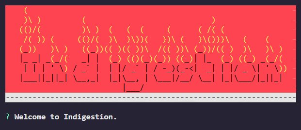
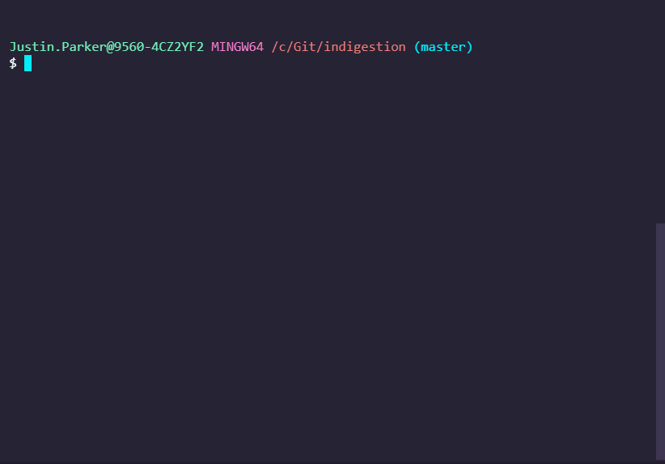

### ***Send messages to PAC for ingestion before test validation via TAPTAP***

---



---

## Goal
**Indigestion**'s goal is to provide an interface that allows users a quick and easy method for sending `test messages` for ingestion into `PAC` in preparation for `TAPTAP` execution.

---

## Installation
**Indigestion** runs in [Node](https://nodejs.org).

* Install [NodeJS](https://nodejs.org)

* Install Indigestion node_module dependencies:
  `npm install`

---

## Run Indigestion
* `npm run indigestion`
* or `node app`
* or `bash indigestion.sh`
* or `indigestion.cmd` (windows)

#### Send All Emails from command line
requires you to have a pre-configured `userconfig.json`
- Pass the `--email` option to `node app` to send emails without using the UI.
- Run one of the following:  
  - `node app --email`
  - `npm run indigestion-email`
  - `bash indigestion-email.sh`
  - `indigestion.cmd` (windows)

---

## Initial Configuration

`Indigestion` creates a `userconfig.json` file the first time it is run.  This file holds your SMTP server and authentication values for sending test emails.  The UI will walk you through setting up the initial values, and you can also choose to update it at any time.  This is your personal `userconfig` file as it holds your authentication to the sending SMTP server (it is in the `.gitignore` and should never to added to `git`)

---

## UI Menu Options

* #### Send all test Emails
  * Loops through all email `.json` files in the `./emails` directory and attempts to send them using your SMTP server and authentication values stored in 'userconfig.json`.

* #### Create new Email file
  * Creates a new email `.json` file and stores it in the `./emails` folder.  The UI will prompt you for all possible email field values (`from`, `to`, `cc`, `bcc`, `subject`, `text`, `html`, `attachments`).

* #### Select Emails for Deletion
  * Multi-select control to select and `delete` Emails from the UI.

* #### Update Userconfig
  * Update your `userconfig.json` file values via UI prompts.

---

## Indigestion Message Structure

* `Idigestion`'s source data for email messages are stored in `json` format (one file per message).  All `json` files in the `emails` directory are parsed for common data fields (from, to, subject, body, etc.) that are used to create and send email messages.

* example email `json` file:  
  ```json
  {
    "from": "\"Justin Parker\" <justin.parker@smarsh.com>",
    "to": "fred@acmecorp.com",
    "cc": "sue@acmecorp.com",
    "subject": "Example email for docs",
    "html": "<div style='color:red;'> Embedded Image:  </div>",
    "attachments": [
       {
         "filename": "fire.png",
         "path": "./attachments/fire.png",
         "cid": "my-fire-picture-id"
       }
    ]
  }
  ```

* Emails are sent using `nodemailer`.  for more info on message structure reference the docs here: https://nodemailer.com/message/


### Attachments

* Local files you want to attach to test emails should be stored in the `./attachments` folder.  This project comes with a wide array of sample files you can use with your emails.  For more info on the various ways to attach files, read the docs here: https://nodemailer.com/message/attachments/

* Embedded image documentation is here: https://nodemailer.com/message/embedded-images/

---

## Ethereal email

* You can setup and test new email messages for tests before using them by creating an etherreal.email account here: https://ethereal.email/.  This will allow you to preview and even download `.eml` files from your test messages for verification beforehand.

---

## Example Run


